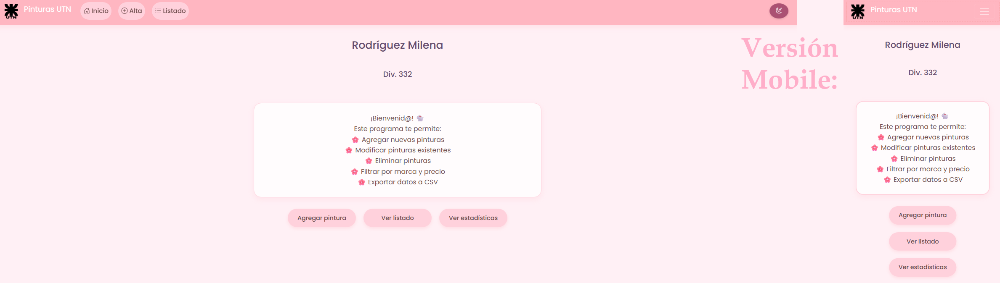
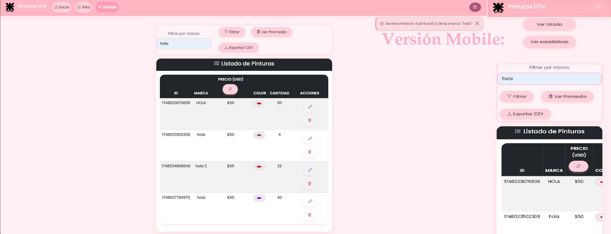
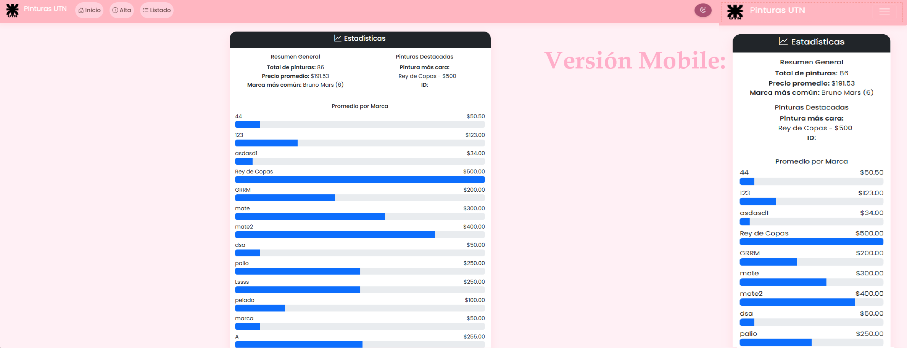
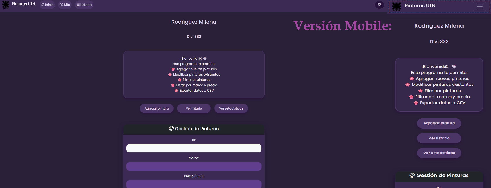
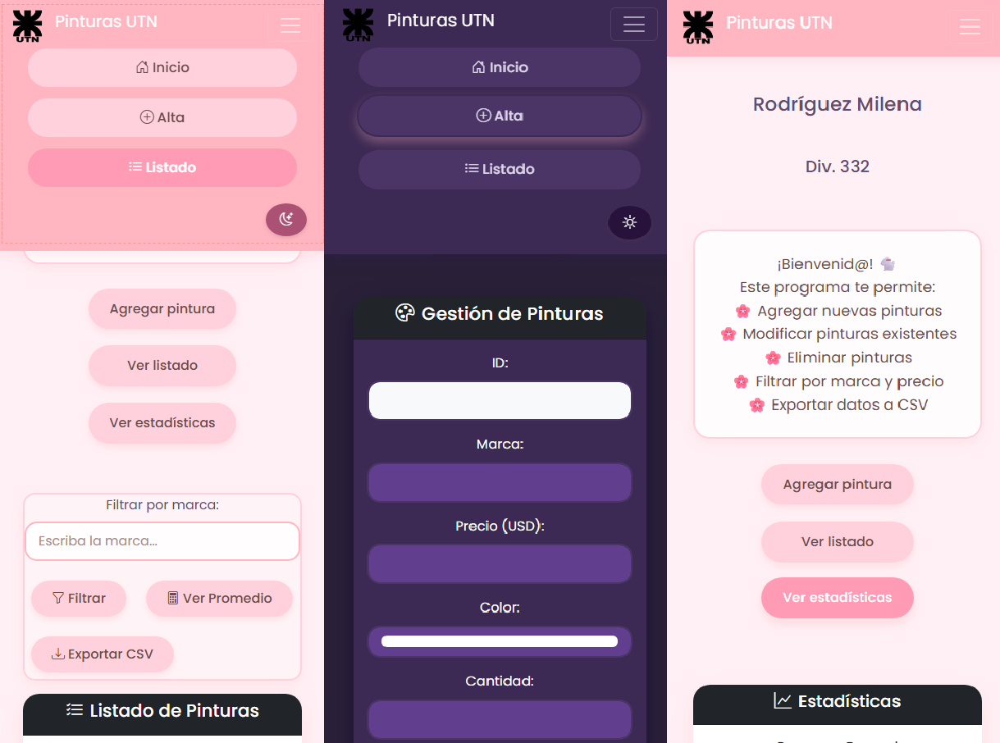

# 🎨 Pinturería UTN – Primer Parcial

Aplicación web desarrollada para gestionar un listado de pinturas. Permite realizar operaciones CRUD (Crear, Leer, Actualizar, Eliminar), aplicar filtros por marca, calcular estadísticas y exportar los datos en CSV. Todo usando JavaScript puro, Bootstrap y conexión con una API externa.

---

## 📁 Estructura del Proyecto
- 📁 `/img` → Icono de la UTN
- 📁 `/css`
  - `style.css` → Estilos personalizados con modo oscuro
- 📁 `/js`
  - `manejadora.js` → Toda la lógica JS (fetch, validaciones, UI)
- 📄 `pintureria.html` → HTML principal con Bootstrap


---

## ⚙️ Funcionalidades

----------------------------------------------------------------------------------------------------
| Sección             | Descripción                                                                 |
|---------------------|-----------------------------------------------------------------------------|
| 🏠 Inicio           | Pantalla de bienvenida, navegación rápida a otras secciones                |
| ➕ Alta             | Formulario para agregar/modificar pinturas con validación en vivo          |
| 📋 Listado          | Tabla dinámica de pinturas con botones para editar o eliminar              |
| 🔍 Filtros          | Filtrar por marca ingresada, calcular promedio de precios y exportar CSV   |
| 📊 Estadísticas     | Cálculo del promedio general, marca más común, pintura más cara, gráficos   |
| 🌗 Modo Oscuro      | Cambia automáticamente el estilo a un tema nocturno                         |
-----------------------------------------------------------------------------------------------------

---

## ✨ Capturas de Pantalla

### 🏠 Pantalla de Inicio



### 📋 Listado con filtros



### 📊 Estadísticas



### 🌙 Modo noche



### 📱 Diseño responsive para móviles



---

## 🧠 ¿Qué aprendí con este proyecto?

### ✅ 1. Manipulación del DOM con JavaScript puro

Aprendí a seleccionar y modificar elementos del DOM usando métodos como `document.getElementById`, `querySelector`, `classList.add/remove`, etc. Esto me permitió manejar eventos, actualizar el contenido de la página en tiempo real y controlar la visibilidad de secciones o formularios.
**Ejemplo:**
```js
document.getElementById("btnAgregar").addEventListener("click", agregarPintura);
document.getElementById("inputMarca").value = pintura.marca || "";
```
También utilicé clases de Bootstrap como `is-valid` e `is-invalid` para dar retroalimentación visual inmediata a los usuarios durante el llenado de formularios.

---

### ✅ 2. Trabajo con APIs REST usando `fetch()` y `async/await`
Aprendí a conectar mi aplicación con una API REST externa, enviando y recibiendo datos mediante `fetch()` y `async/await`. Implementé todas las operaciones CRUD: **crear**, **leer**, **actualizar** y **eliminar** pinturas.
**Ejemplo:**
```js
const res = await fetch(`${API_BASE}/pinturas`, {
  method: "POST",
  headers: { "Content-Type": "application/json" },
  body: JSON.stringify(pintura)
});
```
Además, entendí cómo manejar errores con `try/catch` y mostrar alertas informativas en pantalla si algo falla.

---

### ✅ 3. Validaciones dinámicas con Bootstrap y JavaScript
Realicé validaciones personalizadas para asegurar que los datos del formulario sean correctos antes de enviarlos. Verifiqué tipos de datos, rangos y campos vacíos, y apliqué clases visuales de Bootstrap para informar al usuario.
**Ejemplo:**
```js
if (!precio.value || precioVal < 50 || precioVal > 500) {
  mostrarErrorCampo(precio, "error-precio", "El precio debe estar entre $50 y $500");
}
```
Esto mejora la experiencia del usuario al evitar errores antes de hacer llamadas a la API.

---

### ✅ 4. Modo oscuro con `localStorage`
Implementé un modo oscuro que cambia el tema visual del sitio y guarda la preferencia del usuario en el almacenamiento local (`localStorage`).
**Ejemplo:**
```js
if (body.classList.contains('dark-mode')) {
  localStorage.setItem('modoOscuro', 'activado');
} else {
  localStorage.setItem('modoOscuro', 'desactivado');
}
```
Gracias a esto, el usuario puede conservar su tema preferido incluso al volver a cargar la página.

---

### ✅ 5. Exportar datos como CSV
Aprendí a generar archivos `.csv` desde JavaScript puro y permitir que el usuario los descargue localmente. Esto es útil para reportes o backup de datos.
**Ejemplo:**
```js
const blob = new Blob([csvContent], { type: 'text/csv;charset=utf-8;' });
const url = URL.createObjectURL(blob);
const link = document.createElement('a');
link.setAttribute('href', url);
link.setAttribute('download', 'pinturas.csv');
link.click();
```
Esto me permitió automatizar exportaciones sin usar librerías externas.

---

### ✅ 6. Estructura y organización del proyecto
Aprendí la importancia de dividir el código por responsabilidades:
* `pintureria.html`: estructura de la interfaz
* `style.css`: estética y tema visual (incluyendo modo oscuro)
* `manejadora.js`: lógica del negocio, interacción con la API y el usuario
También reutilicé funciones como `mostrarSeccion()`, `filtrarPinturasValidas()` para evitar duplicar lógica, mejorando la escalabilidad del código.

---

## 🚀 Tecnologías Usadas

- HTML5 + CSS3 + JS
- Bootstrap 5.3
- Bootstrap Icons
- Fetch API
- LocalStorage
- API externa: [https://utnfra-api-pinturas.onrender.com](https://utnfra-api-pinturas.onrender.com)

---

> Desarrollado por **Milena Rodríguez – Div. 332**  
> Primer parcial de Programación III | UTN


